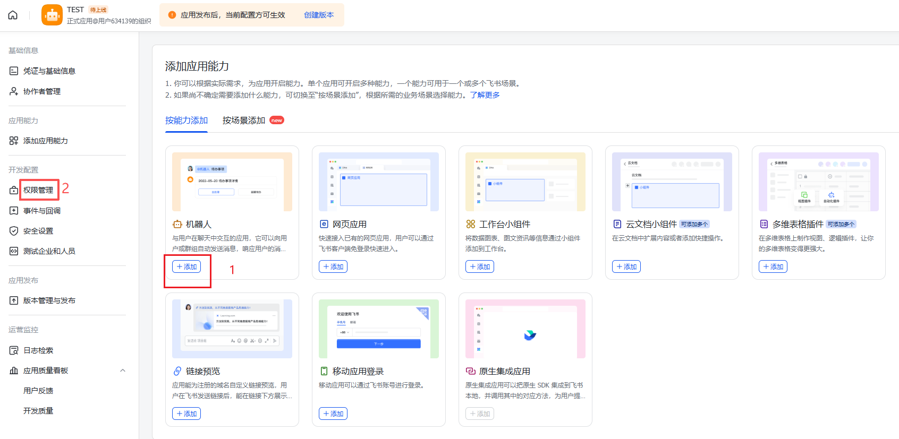
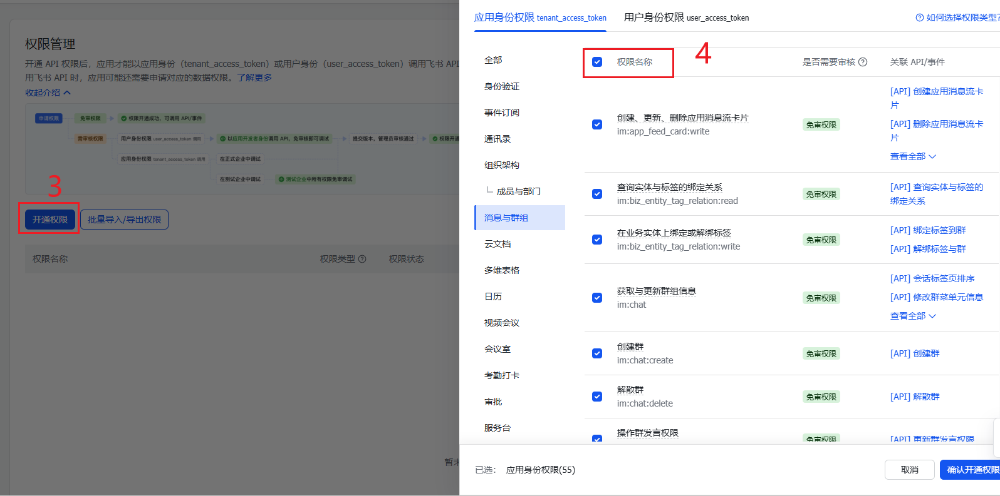
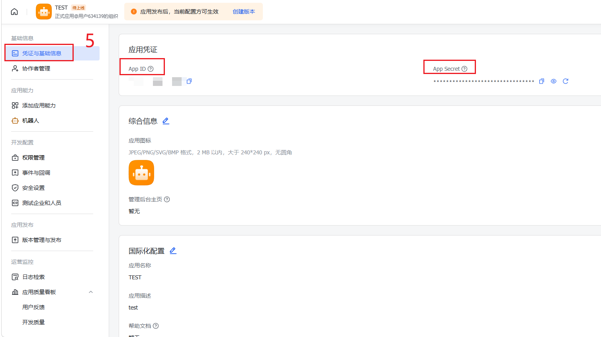
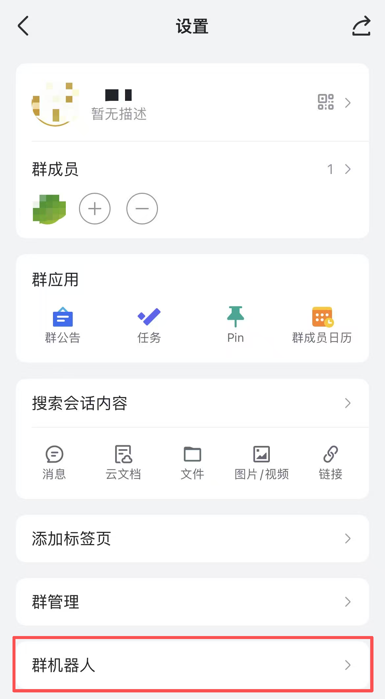
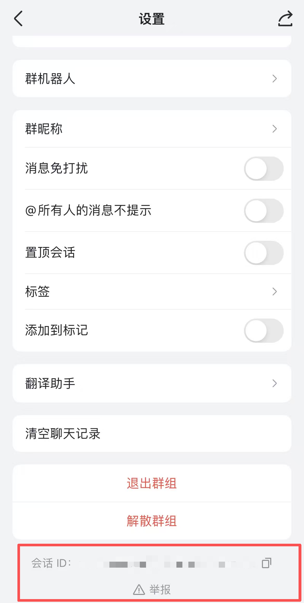

# Feishu Setup Guide up to Entering the `chat_id` in `codexloop init`

This document focuses on one specific task only:

starting from scratch, preparing all information required for a Feishu bot, and then running `codexloop init` in the current project until the `Feishu chat id` field is filled in.

It does **not** cover subsequent steps such as `/run`, `/inject`, message delivery validation, or troubleshooting.

## 0. Verify Local Prerequisites

Enter the current repository directory:

```bash
cd ./ArgusBot
```

Confirm that both codex and codexloop are available:

```bash
codex --help
codexloop help
```

If codexloop is not available in your PATH, install the current repository in editable mode first:

```bash
pip install -e .
```

## 1. Create a Custom Application in the Feishu Open Platform

1. Open the Feishu Open Platform[https://open.feishu.cn/app]。
2. Enter the developer console.
3. Create a Custom App.
4. Assign the application an easily recognizable name, for example, ArgusBot Control.
5. After creation, open the application details page.

You will need the following two values later:

- `App ID`
- `App Secret`

Please save them, as `codexloop init` will later prompt you for:

- `Feishu app id`
- `Feishu app secret`

<div align="center">

</div>

<div align="center">

</div>

<div align="center">

</div>

## 2. Prepare a Dedicated Feishu Group Chat

It is recommended to create a dedicated group chat exclusively for this repository, for example:

- Group name:`ArgusBot Control`

Then add the newly created Feishu bot application to this group.

The rationale is straightforward:

- the current Feishu control channel in this repository reads messages by polling a specific `chat_id`
- each group chat corresponds to a unique `chat_id`
- using a dedicated group minimizes the risk of message interference

## 3. Obtain the `chat_id` of the Group

You now need to retrieve the conversation ID of the dedicated group created above.
A practical approach is as follows:

1.Open the target group chat.Open the target group chat.
2.Scroll to the bottom, where the chat_id will be displayed.

If you obtain a different type of identifier instead, the project may fail to send messages to the intended group or fail to receive commands during polling.

<div align="center">
  
  
</div>

## 4. What `chat_id` Means in This Project

In this project, the configured `Feishu chat id` is not a user ID, nor an `open_id`.
Instead, it refers to the conversation ID / group chat ID, namely the chat_id used by the Feishu messaging API. In the current codebase, both Feishu message sending and polling directly use this value as the conversation identifier.

A typical chat_id looks like:

```text
oc_xxxxxxxxxxxxxxxxxxxxxxxxxxxxxxxx
```

## 5. Run `codexloop init` in the Current Project

Make sure you are inside the target project directory:

```bash
cd ./ArgusBot
```

Then run:

```bash
codexloop init
```

During initialization, you will see prompts similar to the following:

```text
Default check command (optional):(一般可以直接回车跳过)
Select model preset:
Select play mode:
Enable Feishu bidirectional control? [y/N]:
Feishu app id:
Feishu app secret:(为了保证安全性，在输入密码后不会类似app id显示出来，复制粘贴后回车即可)
Feishu chat id:
```

Fill them in as follows:

1. `Enable Feishu bidirectional control?`
Enter `y`

2. `Feishu app id:`
Enter the `App ID` shown in the Feishu Open Platform

3. `Feishu app secret:`
Enter the `App Secret` shown in the Feishu Open Platform

5. `Feishu chat id:`
Enter the target group `chat_id` obtained above

At this point, this document ends.

## 6. Where the Configuration Will Be Written

After `codexloop init` completes, the configuration will be written to:

```text
.codex_daemon/daemon_config.json
```

The Feishu-related fields are:

```json
{
  "feishu_app_id": "...",
  "feishu_app_secret": "...",
  "feishu_chat_id": "oc_xxx"
}
```

## 7. Minimal Checklist

Before running `codexloop init`, you only need to confirm the following four items:

- a Feishu custom app has been created
- the `App ID` has been obtained
- the `App Secret` has been obtained
- the target group `chat_id` has been obtained

Once these four values are ready, you can start `codexloop init` and enter the `Feishu chat id`.
