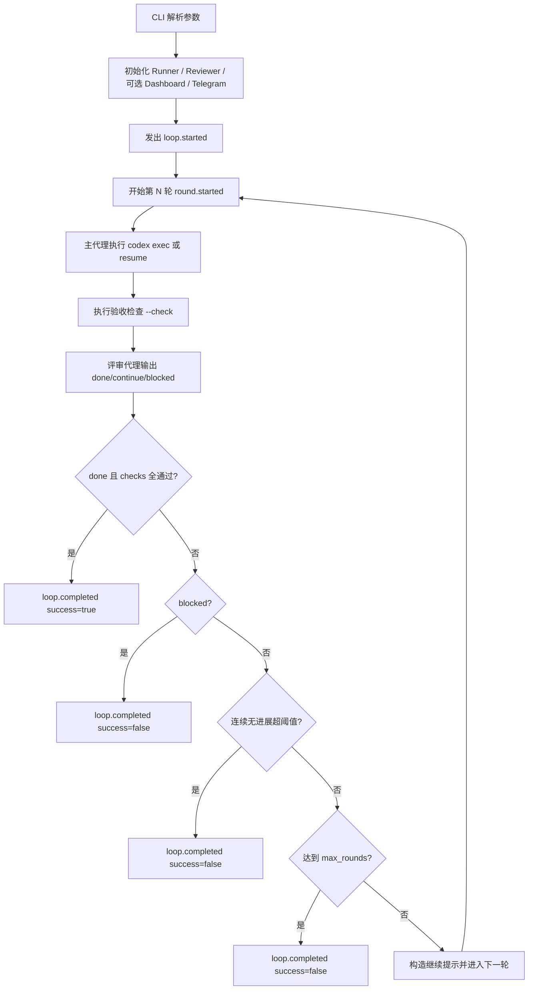

# codex-autoloop Pipeline

## 1. 目标

`codex-autoloop` 的执行目标是：让主代理持续实现任务，由评审代理把关，只有在“任务完成 + 验收检查通过”时才停止循环。

## 2. 端到端流程总览



## 3. 每轮（Round）详细步骤

1. 发出 `round.started` 事件。
2. 主代理执行（首轮 `exec`，后续基于 `session_id` resume）。
3. 记录主代理结果：
   - `exit_code`
   - `turn_completed` / `turn_failed`
   - `fatal_error`
   - `last_message`
4. 运行所有 `--check` 命令，收集每条检查的通过状态。
5. 调用评审代理，产出结构化决策：
   - `status`: `done` / `continue` / `blocked`
   - `confidence`
   - `reason`
   - `next_action`
6. 产出 `RoundSummary` 并可选写入 `--state-file`。
7. 根据停止条件决定结束或继续下一轮。

## 4. 停止条件（按优先级）

1. `review.status == done` 且所有 checks 通过 -> 成功结束。
2. `review.status == blocked` -> 失败结束。
3. 连续无进展轮数达到 `max_no_progress_rounds` -> 失败结束。
4. 到达 `max_rounds` -> 失败结束。

## 5. 关键事件流

- `loop.started`
- `round.started`
- `round.main.completed`
- `round.checks.completed`
- `round.review.completed`
- `loop.completed`

这些事件会同时驱动可选能力：
- Dashboard 状态更新
- Telegram 通知
- 终端实时消息输出

## 6. 输入与输出

### 输入

- 必填：`objective`
- 常用控制项：
  - `--max-rounds`
  - `--max-no-progress-rounds`
  - `--check`（可重复）
  - `--state-file`
  - `--session-id`（续跑）

### 输出

- 终端 JSON 总结：
  - `success`
  - `session_id`
  - `stop_reason`
  - `rounds[]`（每轮关键指标）
- 可选状态文件（`--state-file`）：
  - 全量轮次信息与最新评审状态

## 7. 最小使用示例

```bash
codex-autoloop \
  --max-rounds 10 \
  --check "pytest -q" \
  "帮我在这个文件夹写一下pipeline"
```

